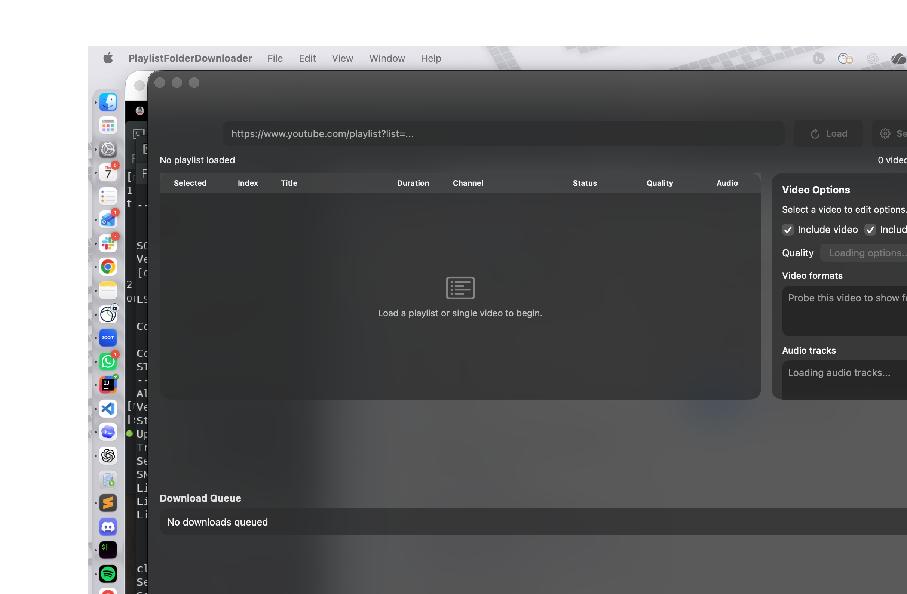
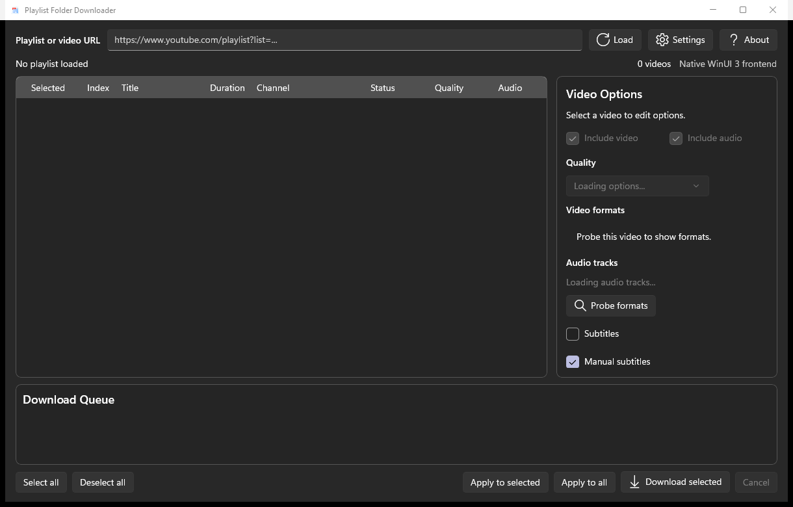
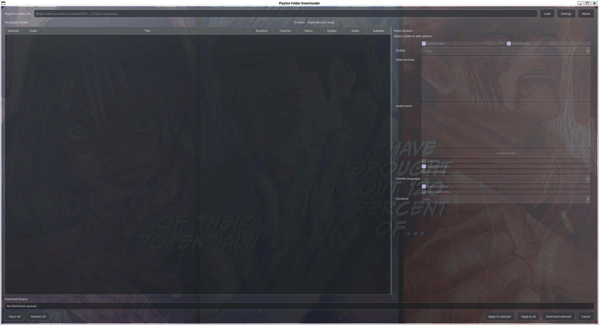

# Playlist Folder Downloader

Playlist Folder Downloader is a Python 3.11+ desktop application for authorized YouTube playlist and single-video downloads. Paste a playlist URL or a supported video URL, review the videos, choose per-video quality/audio/subtitle options, and download selected videos into a folder named after the playlist or single video.

The cross-platform app uses PySide6/Qt. On Linux, including Arch Linux and CachyOS, the Qt frontend uses a dark acrylic-style surface with system ffmpeg/yt-dlp integration. On macOS, the repo also includes a native SwiftUI frontend that talks to the same Python backend and uses Apple UI materials, `NSVisualEffectView`, and Liquid Glass APIs when they are available on the installed macOS SDK. On Windows, the repo includes a native WinUI 3 frontend built on Windows App SDK with Windows 11-style Acrylic/Mica materials.

## macOS Native Frontend



The macOS frontend is built with SwiftUI and keeps the Python service layer for yt-dlp metadata probing and downloads. It uses native macOS window materials and glass-style controls, while the cross-platform Qt frontend remains available as the portable fallback across desktop platforms.

## Windows Native Frontend



The Windows frontend is built with WinUI 3 and keeps the same Python service layer used by the Qt and macOS frontends. It supports playlist and single-video loads, automatic per-video probing, per-video options, JSON-lines download progress, cancellation, and native Windows 11 visual treatment through Acrylic with a Mica fallback.

## Linux / CachyOS Qt Frontend

<!-- Save the current Linux/WSLg screenshot as docs/assets/linux-cachyos-wsl.png and keep this image enabled. -->


The Linux frontend is the PySide6/Qt app tuned for Arch Linux and CachyOS-style desktop testing. It keeps the same Python service layer, prefetches per-video formats after playlist load, preselects the best available video/audio formats, shows queue progress percentages, and supports per-download cancel, retry, and queue removal actions.

## Authorized Use Only

Use this app only for videos you own, videos you have permission to download, or videos that are explicitly licensed for download. The MVP supports public, unrestricted playlist metadata and downloads through yt-dlp. It does not support cookie import, private playlists, account login, DRM or access-control bypass, CAPTCHA bypass, or credential collection.

## Requirements

- Python 3.11 or newer
- FFmpeg and ffprobe on `PATH` for merging separate audio/video streams, embedding subtitles, and multi-audio downloads
- A JavaScript runtime supported by yt-dlp, preferably Deno or Node.js, for reliable current YouTube extraction
- Python dependencies from `requirements.txt`
- Optional for the native Windows frontend: .NET 8 SDK or newer SDK capable of targeting `net8.0-windows`

FFmpeg is warning-level at startup because some audio-only or already-combined formats may still download, but most high-quality YouTube downloads require it.

Node.js is commonly available through nvm or Homebrew on macOS. The app detects Deno/Node automatically and passes it to yt-dlp.

## Install

```bash
uv sync --extra dev
```

## Run in Development

Cross-platform Qt frontend:

```bash
uv run python scripts/check_env.py
uv run python scripts/run_dev.py
```

You can also run the package directly:

```bash
uv run python -m playlist_folder_downloader
```

Native macOS SwiftUI frontend:

```bash
uv run python scripts/check_env.py
./scripts/run_macos_native.sh
```

The SwiftUI frontend is macOS-only. It still uses the Python service layer through `uv run python -m playlist_folder_downloader.cli`, so the same authorized-use limits, yt-dlp behavior, FFmpeg requirement, and tests apply.

Native Windows WinUI 3 frontend:

```powershell
uv run python scripts/check_env.py
.\windows\PlaylistFolderDownloader\run.ps1
```

The Windows frontend targets `net8.0-windows10.0.19041.0`. Its runtime backend launcher prefers the repository `.venv\Scripts\python.exe` when present and falls back to `uv run python`.

Arch Linux or CachyOS-style testing through WSLg:

```bash
cd /mnt/e/Coding/Personal/YTPlaylistDownloader
export UV_PROJECT_ENVIRONMENT="$HOME/.venvs/ytplaylistdownloader"

uv sync --extra dev
uv run python scripts/check_env.py
QT_QPA_PLATFORM=xcb uv run python scripts/run_dev.py
```

Use `UV_PROJECT_ENVIRONMENT` when running from `/mnt/e/...` so Linux does not try to reuse the Windows `.venv`. `QT_QPA_PLATFORM=xcb` is the most reliable WSLg launch mode for this app.

If you prefer working from the WSL filesystem for faster file I/O:

```bash
mkdir -p ~/src/YTPlaylistDownloader
rsync -a --delete \
  --exclude .venv \
  --exclude .pytest_cache \
  --exclude .ruff_cache \
  /mnt/e/Coding/Personal/YTPlaylistDownloader/ \
  ~/src/YTPlaylistDownloader/

cd ~/src/YTPlaylistDownloader
uv sync --extra dev
QT_QPA_PLATFORM=xcb uv run python scripts/run_dev.py
```

## Per-Video Options

Each video can have its own download options:

- Include video, audio, or audio only
- Quality choices based on the selected video's actual available heights after probing
- Optional exact video and audio format selections from the selected video's detected formats
- Multiple audio tracks when yt-dlp exposes them for that video
- Manual subtitles and/or automatic captions
- Subtitle language choices based on the selected video's detected subtitles/captions
- Embedded subtitles or separate subtitle files
- Preferred container: MKV, MP4, or WebM

Single video links are shown as a one-item collection, so the same options and download queue are used for both playlists and individual videos.

When embedded subtitles or multiple audio tracks are enabled, the app switches to MKV because it is the most compatible container for those outputs.

On the Qt and native macOS frontends, playlist rows are probed in the background after load so the quality, audio-track, and subtitle controls fill in as metadata becomes available. If probing fails for a row, the downloader retries probing that video immediately before download.

## Build Packages

Build scripts run tests and linting before invoking PyInstaller.

Windows:

```powershell
.\scripts\build_windows.ps1
```

macOS:

```bash
./scripts/build_macos.sh
```

For the native SwiftUI macOS frontend, build the Swift package directly:

```bash
cd macos/PlaylistFolderDownloader
swift build --scratch-path .swiftpm-cache
```

For the native WinUI 3 Windows frontend, build the .NET project directly:

```powershell
dotnet build .\windows\PlaylistFolderDownloader\PlaylistFolderDownloader.csproj -p:Platform=x64
```

Linux:

```bash
./scripts/build_linux.sh
```

Arch Linux:

`scripts/archlinux/PKGBUILD.template` is a template for a future Arch package. It depends on `python`, `python-pyside6`, `yt-dlp`, and `ffmpeg`, and installs a launcher script.

For Arch Linux or CachyOS development dependencies:

```bash
sudo pacman -S --needed \
  base-devel git rsync sudo \
  python python-pip python-build python-installer python-wheel python-platformdirs \
  pyside6 pyside6-tools \
  python-pytest python-pytest-qt python-ruff \
  uv yt-dlp ffmpeg nodejs npm deno \
  qt6-base qt6-wayland qt6-svg qt6-tools \
  breeze breeze-icons \
  xdg-utils xdg-desktop-portal xdg-desktop-portal-kde \
  desktop-file-utils appstream namcap
```

For Arch package checks from a real Arch/CachyOS shell:

```bash
cd scripts/archlinux
makepkg -sf
namcap PKGBUILD
desktop-file-validate *.desktop
appstreamcli validate *.metainfo.xml
```

## Test and Lint

```bash
uv run python -m pytest -q
uv run python -m ruff check .
```

When testing from Arch WSL:

```bash
cd /mnt/e/Coding/Personal/YTPlaylistDownloader
export UV_PROJECT_ENVIRONMENT="$HOME/.venvs/ytplaylistdownloader"

uv run python scripts/check_env.py
uv run python -m pytest -q
uv run python -m ruff check .
```

Tests are offline and use fixtures/mocks only. They do not contact YouTube or download media.

## Credits

Playlist Folder Downloader uses [yt-dlp](https://github.com/yt-dlp/yt-dlp) as its backend for public metadata extraction and authorized media downloads. yt-dlp does the heavy lifting for playlist/video probing, format discovery, and download orchestration; this project provides the desktop UI, per-video option workflow, folder/file naming, and packaging around it.

FFmpeg and ffprobe are used for merging separate audio/video streams, embedding subtitles, and multi-audio output when those options are selected.

## MVP Limitations

- Authorized downloads only.
- Public, unrestricted playlists only.
- No cookie import.
- No DRM or access-control bypass.
- Private playlists are not supported.
- Multi-audio availability depends on what yt-dlp can detect for a video.
- Subtitle availability depends on the source video.
- FFmpeg/ffprobe are required for robust high-quality merges and subtitle embedding.
